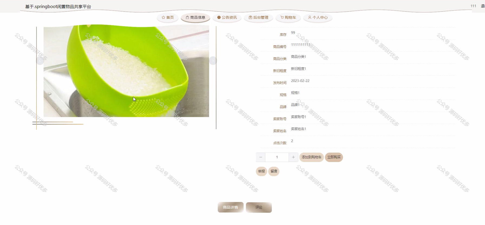

 
## 查看主页获取源码

### 一、作品包含

源码+数据库+设计文档万字+PPT+全套环境和工具资源+部署教程

### 二、项目技术

前端技术：Html、Css、Js、Vue、Element-ui

数据库：MySQL

后端技术：Java、Spring Boot、MyBatis

  

### 三、运行环境

开发工具：IDEA/eclipse

数据库：MySQL5.7

数据库管理工具：Navicat10以上版本

环境配置软件： JDK1.8+Maven3.6.3

前端Nodejs：14

### 四、项目介绍
项目编号：springbootA199

在倡导绿色生活、循环经济和可持续发展的时代背景下，闲置物品共享平台应运而生。该平台通过互联网技术，将个人或企业闲置的资源进行有效整合，实现物品的再利用和共享，不仅减少了资源浪费，提高了物品的利用率，同时也为用户提供了便捷、经济的资源共享方式，促进了社区内的互动与合作，展现了共享经济在现代社会中的积极意义和实践价值。

前台用户功能：浏览首页、商品信息、公告资讯、后台管理、购物车和个人中心。

后台分为管理员、用户、卖家
管理员的功能：系统首页、个人中心、用户管理、卖家管理、商品分类管理、商品信息管理、商品举报管理、留言信息管理、系统管理。
用户的功能：系统首页、个人中心、商品举报管理、留言信息管理。
卖家的功能：系统首页、个人中心、商品信息管理、商品举报管理、留言信息管理、订单管理。

### 五、运行截图

  
